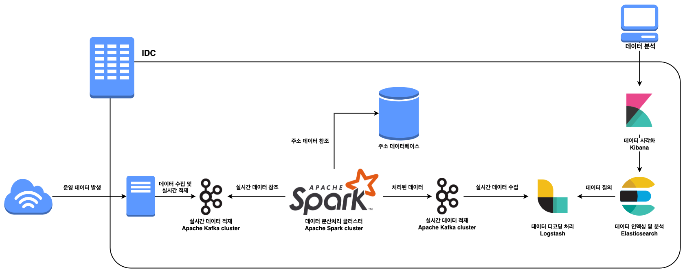
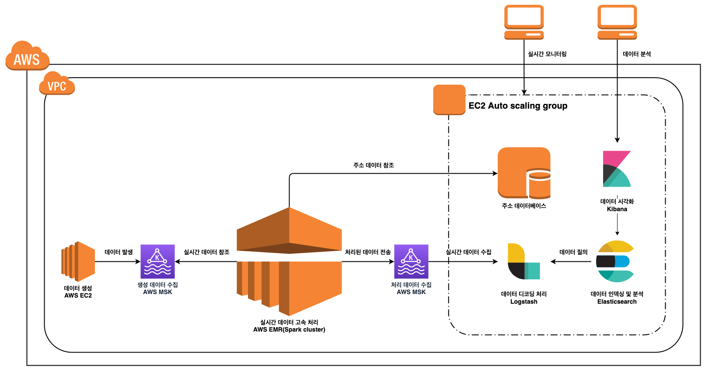

# rdw-reference-architecture
빅데이터 분석을 위한 RDW(Realtime Data Warehouse) 아키텍처입니다.

## 개요

데이터를 기반으로 한 의사결정이 본격화되면서 실시간 데이터 처리 및 분석에 수요도 높아지고 있습니다. 이에 스타트업이나 레거시 서비스를 운영하는 기업에서 실시간 데이터 기반의 애자일 어프로치를 위해 RDW를 구축하는 수요도 늘고 있습니다. 많은 클라우드 서비스 프로바이더와 협력 제공업체들이 관련 솔루션을 제공하고 있지만 비용적 부담으로 인해 쉽게 시작하지 못하고 있는 실정입니다.

이에 SPARK+ 팀은 데이터 조직에서 구축했던 RDW의 아키텍처를 공개합니다. 인프라에 자유롭고 확장 가능하며, 대체가능한 오픈소스들로 구현되어 있어 모든 조직에서 저비용으로 데이터 분석을 시작할 수 있도록 공적 이익에 기여하는 것을 목표로 합니다.

## 목표

SPARK+팀은 레퍼런스 아키텍처의 공개를 통해 더 많은 조직에서 데이터 기반의 의사결정을 할 수 있도록 기여하는 것을 목표로 하고 있습니다. 또한 레퍼런스 아키텍처에 그치지 않고 다양한 인프라와 기술셋으로 도메인와 컨텍스트에 맞는 아키텍처를 구성하시기를 바랍니다.

## On-premise RDW 예제

## 클라우드 예제 RDW (AWS)

## 비용

이 예제에서는 500bytes 내외의 데이터를 초당 10000건 이상 처리했던 아키텍처이며 AWS 클라우드에서 구현했습니다. 아래의 리소스 사용량, 실사용 데이터 사이즈, 관리 인력에 따라 컴퓨팅 인스턴스 선택과 관리형 서비스를 선택하여 구축하시길 바랍니다.

- **총 비용: $1251.4**
- 데이터베이스
  - EC2 8vCPU, 32GB RAM, 단일 인스턴스 
  - 비용: **$194.92**
- 데이터 처리: EMR cluster(Apache Spark)
  - r5.xlarge
    - 4 vCPU, 32GB RAM, 1마스터-2코어 노드
  - dirver 노드 평균 60-80% CPU usage
  - 비용: **$450.56**
- (MSK) Managed Kafka
  - 2 broker, 500GB per broker(auto scaling)
    - Brokers' CPU usage avg: 8-10%
  - 비용: **$490.81**
- ELK
  - c4.xlarge
    - 4 vCPU, 7.5 GB RAM
  - **비용: $115.11**

## LICENSE

[MIT](https://github.com/SWM-SparkPlus/rdw-reference-architecture/blob/main/LICENSE)