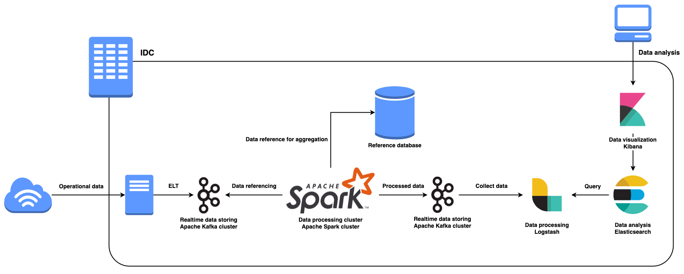
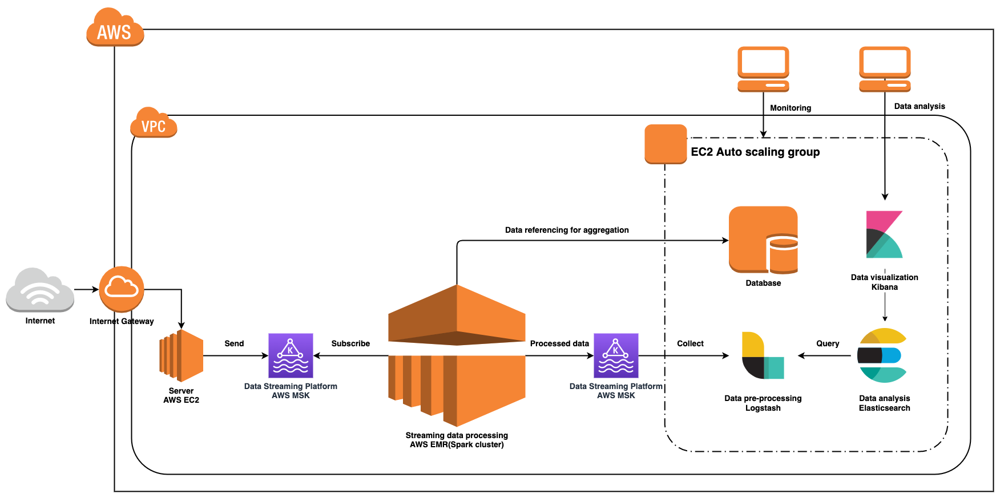

# rdw-reference-architecture

A RDW reference architecture

[🇰🇷 한국어 README](https://github.com/SWM-SparkPlus/rdw-reference-architecture/blob/main/README.kr.md)

## Overview

As data-based decision making is in full swing, the demand for real-time data processing and analysis is also increasing. Accordingly, there is an increasing demand for startups and companies running legacy services to deploy RDW for an agile approach based on real-time data. Many cloud service providers and cooperative providers are providing related solutions, but it is not easy to get started due to the cost burden.

In response, the SPARK+ team discloses the architecture of the RDW that the data organization has built. It is implemented as free, scalable, and replaceable open sources in its infrastructure, which aims to serve the public interest so that any organization can start analyzing data at low cost.

## On-premise RDW example

## Cloud RDW example (AWS)

## Pricing

In this example, it is an architecture that processed more than 10000/s of data, data is about 500 bytes, and it was implemented in the AWS Cloud. You should select and build a compute instance and managed service according to the resource usage below, actual data size, and management personnel.

- **Total price: $1251.4**
- Database
  - EC2 8vCPU, 32GB RAM, single **instance**
  - Pricing: **$194.92**
- Data processing: EMR cluster(Apache Spark)
  - r5.xlarge
    - 4 vCPU, 32GB RAM, 1 master - 2 core nodes
  - Driver node's CPU usage avg: 60-80% 
  - Pricing: **$450.56**
- (MSK) Managed Kafka
  - 2 broker, 500GB per broker(auto scaling)
  - Pricing: **$490.81**
- ELK
  - c4.xlarge
    - 4 vCPU, 7.5 GB RAM
  - Pricing: **$115.11**

## LICENSE

[MIT](https://github.com/SWM-SparkPlus/rdw-reference-architecture/blob/main/LICENSE)